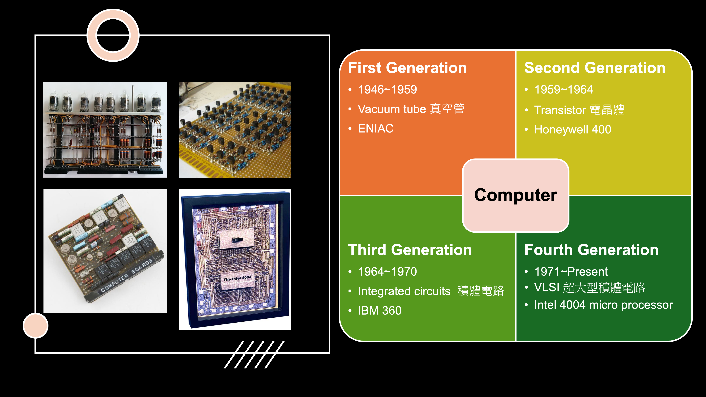
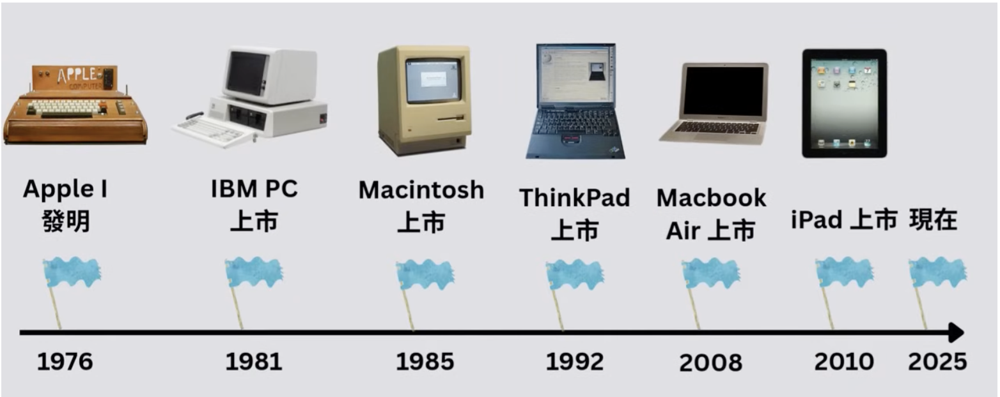
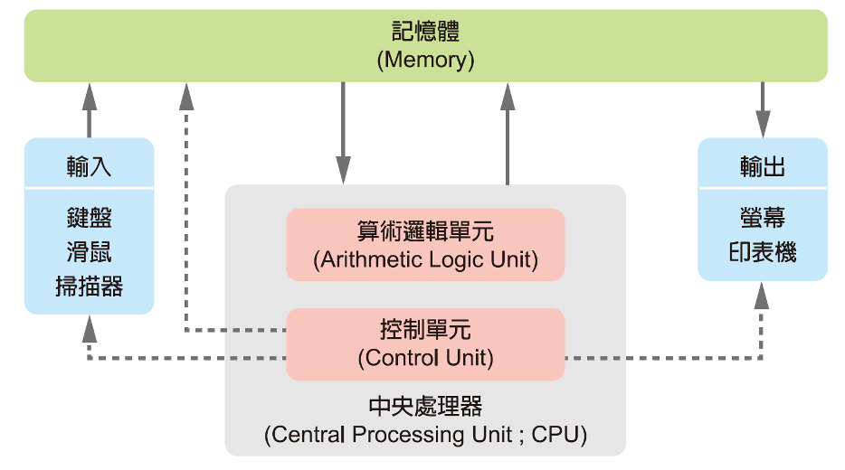

# Introduction to Computer
> Computer is a tool to support people to compute.

> A computer is a machine that can be programmed to automatically carry out sequences of computations such as arithmetic and logical operations. (Wikipedia)

# Computing Tool Foundation
- 3000 BCE, Abacus (算盤)
- 1642, Blaise Pascal, mechanical adding machine (機械式加法器)
- 1801, Joseph-Marie Jacquard, Jacquard loom (緹花織布機), use punch cards (打孔卡片) to control the patterns, introducing programming concept and data storage.
- 1937, Alan Turing, Turing machine (圖靈機), 圖靈機不是一個真正的「機器」，而是「理論數學」的模型。證明了只要一組簡單的讀寫規則，加上無限的記憶體(紙帶)，就能夠執行任何複雜的演算法.

# Modern Computer Development
The core of modern computer evolution lies in the electronization of hardware and the adoption of binary computation, enabling optimal efficiency in data storage, processing, and transmission.

# Moore's Law (摩爾定律)
- Moore's law is the observation that the number of transistors in an integrated circuit (IC) doubles about every two years, with minimal increase in cost.

# Personal Computer (PC)
- 1975, Altair 8800, the first personal computer (PC)
- 

- 

- 1981, Microsoft launch MS-DOS 1.0 (Microsoft Disk Operating System)
- 1985, Microsoft launch Windows 1.0

# The Evolution of the Internet (1)

# The Evolution of the Internet (2)
- 1969, ARPANET, a U.S. research network funded by ARPA.
- 1983, TCP/IP becomes the common Internet protocol.
- 1989, Tim Berners-Lee proposes the World Wide Web at CERN.
- 1993, Mosaic popularizes graphical web browsing
- 1994–1995, Netscape Navigator and Internet Explorer.
- 2000–2001, dot-com bubble boom and bust.
- 2004–2005, social media expands: Facebook and YouTube.
- 2007–2008, smartphones and app stores: iPhone, Android, mobile apps.
- 2010s, IoT, cloud computing, and mobile broadband expand.
- 2022–2023, ChatGPT launches and generative AI becomes mainstream.

# General Architecture of Computers
The general architecture of today's computers is based on the von Neumann Model (馮紐曼模式), which is based on the concept of **stored program**, including four subsystems
- Memory: store data and programs
- Arithmetic Logic Unit (ALU): perform arithmetic and logical processing
- Control Unit (CU): direct other subsystems and tells them what to do.
- Input／Output: keyboard, mouse, screen, printer

> ALU + CU = CPU (Central processing Unit)

# von Neumann Model

