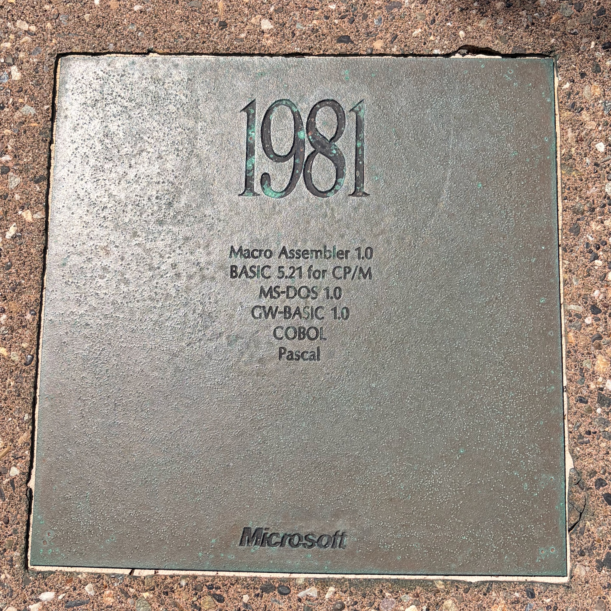

# Introduction to Computer
> Computer (計算機 / 電腦) is a tool to support people to compute.

> A computer is a programmable device designed to store, retrieve, and process data to solve complex computational problems.

> A computer is a machine that can be programmed to automatically carry out sequences of computations such as arithmetic and logical operations. (Wikipedia)

# Memorabilia of Computer
- 3000 BCE, Abacus (算盤)
- 1642, Blaise Pascal, mechanical adding machine (加法器)
- 1801, Joseph-Marie Jacquard, Jacquard loom (緹花織布機), use punch cards to control the weaving of patterns, introducing programming concept and data storage.
- 1937, Alan Turing, Turing machine (圖靈機), 證明了只要一組簡單的讀寫規則，加上無限的記憶體(紙帶)，就能夠執行任何複雜的演算法

# Evolution of Computers

# Personal Computer (PC)
- 1975, Altair 8800, the first personal computer (PC)
- 1977, Apple II, the first successful personal computer (PC)
- 1981, IBM open the PC architecture, PC become the most mainstream product
- 1981, Microsoft launch MS-DOS 1.0 (Microsoft Disk Operating System)
- 1984, Apple Macintosh, the first personal computer (PC) with GUI
- 1985, Microsoft launch Windows 1.0

# Internet and World Wide Web (WWW)

- 1969, ARPANET, an early computer network to transmit sensitive military data.
- 1989, World Wide Web (WWW), Tim Berners-Lee.
- 1993, Browsers: Mosaic, Netscape Navigator and Internet Explorer.
- 2000, dot com company boom and bust
- 2004, social media platforms: YouTube, Facebook
- 2007, smartphones, iPhone and Android
- 2010, IoT (internet of things)
- 2023, AI ChatGPT

# Common Architecture of Computers
The arithmetic logic unit and the control unit together are called the Central Processing Unit (CPU). CPU)。
