# Digital Data Representation
- Bit and byte
- Different base representation
- Storing integer
- Storing floating-point
- Storing text
- Storing image
- Storing sound

# Bit and Bit Patterns
- The bit (binary digit) is the most basic unit of information in computing and communication. The bit represents a logical state with one of two possible values like 0 or 1, true/false, yes/no, or on/off
- The bit pattern is a sequence of bits used by computers to store and represent data, like text, numbers, sound, or image.
- N bits can generate 2n different combinations to represent 2n bit patterns. 

# Byte (8 bits = 1 byte)
- Byte is a unit of digital information that most commonly consists of eight bits. (8 bits = 1 byte)
- Historically, the byte was the number of bits used to encode a single character of text in a computer and for this reason it is the smallest addressable unit of memory in many computer architectures. 
- 8 bits generate 256 different objects (bit patterns), which is enough to represent English character set, including 26 uppercase and 26 lowercase letters, 10 numbers, 33 punctuations, 33 control characters.
- In ASCII, one character is represented by 8 bits.

# Unit of Size
| Unit| Full Name | Exact Bytes | Approximate Bytes | Example |
| --- | --- | --- | --- | --- |
| KB | Kilobyte | $2^{10}$ | $10^3$ | The size of this file is about 238 KB. |
| MB | Megabyte | $2^{20}$| $10^6$ | The size of this image is about 3.6 MB. |
| GB | Gigabyte | $2^{30}$| $10^9$ | The capacity of this DVD is 4.7 GB. |
| TB | Terabyte | $2^{40}$ | $10^{12}$ | This high-capacity disk can store 20 TB of data. |

# 二 / 八 / 十 / 十六 進位表示法
- 十進位：0 ~ 9 &nbsp;&nbsp;&nbsp;&nbsp;&nbsp;  **4510**
- 二進位(bin)：0, 1  &nbsp;&nbsp;  **1011012** 或是 0b101101
- 八進位(oct)：0 ~ 7 &nbsp;&nbsp;  **558** 或是 0o55
- 十六進位(hex)：0 ~ 9, A ~ F &nbsp;&nbsp;  **2d16** 或是 0x2d
*-* A: 10
*-* B: 11
*-* C: 12
*-* D: 13
*-* E: 14
*-* F: 15

# 二 / 八 / 十六進位表示法與轉換成十進位表示法
- 十進位表示法: 523 = 5個100 + 2個10 + 3個1 = 5×102 + 2×101 + 3
- 二進位表示法: 1000001011 = 1×29 + 1×23 + 1×21 + 1×20
- 八進位表示法: 1013 = 1×83 + 1×81 + 3×80
- 十六進位表示法: 20B = 2×162 + 11×80

- 以B為基數，則 dndn-1...d2d1.r1r2...rm-1rm 表示的數：
dn×Bn-1 + dn-1×Bn-2 + ... + d2×B1 + d1×B0 + r1×B-1+ r2×B-2 + ... + rm-1×B-(m-1) + rm×B-m

- [Lab] 將 10110101.11012 轉成十進位數 

# 十進位表示法轉換成 二 / 八 / 十六進位表示法

[Lab] 將 18110 轉成二進位 
[Lab] 將 0.812510 轉成二進位 

# 二進位的循環小數
- 雖然有限位數的二進位表示法，永遠無法精確地表示十進位的0.1，一般的情況下，可能就只好容許這種小誤差. 
- 如果你真的非常注重浮點數的精確度，比如說核子反應爐或是太空船登陸軌跡的計算，你可以使用 Python decimal module 來控制浮點數的精確度
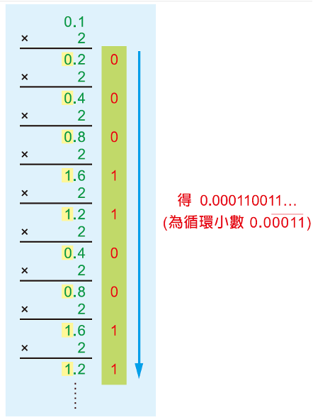

# 二進位與十六進位的互換

    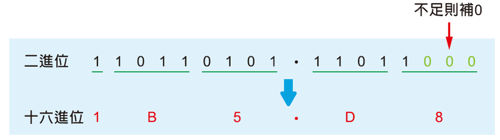
    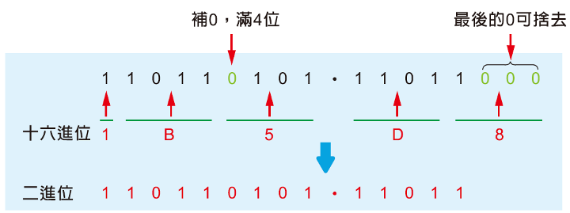

# Storing Integer
- Two's complement notation (二補數表示法) is the most common method of representing signed (positive, negative, and zero) integers on computers.
- Two's complement uses the most significant bit as the sign to indicate positive (0) or negative (1) numbers
  - The nonnegative numbers are given their unsigned representation (6 is 0110, zero is 0000)
  - The negative numbers are represented by the rightmost zeros and the first 1 on the far right remain unchanged, and the rest of the digits are converted to complements (−6 is 1010).

# Coding -6 in Two’s Complement Using 4 Bits
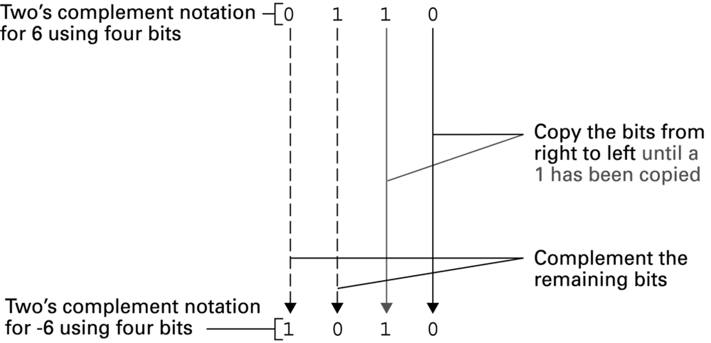

# Steps to Get Two's Complement of 40 Using 8 Bits
- Convert 40 to a binary value of 101000
- Fill in 0 to the left of the binary value, so that 00101000 has a total of 8 bits
- Because the number to be represented is positive, so 00101000 is the request.

# Steps to Get Two's Complement of -40 Using 8 Bits
- Convert 40 to a binary value of 101000
- Add 0 to the left of the binary value so that 00101000 has a total of 8 bits
- Since the number to be represented is negative, the three zeros on the far right and the first 1 remain unchanged, and the rest will turn the original 0 to 1; The original 1 to 0 gets 11011000

# What is The Value of The Two's Complement "11011000"
- Because the leftmost bit is 1, keep the three zeros on the far right and the first 1 on the far right first, and then turn the other bits from 0 to 1; The original 1 to 0 gets 00101000
- Convert the binary 00101000 to the decimal 40 and add a negative sign to get -40

# The Two's Complement Notation
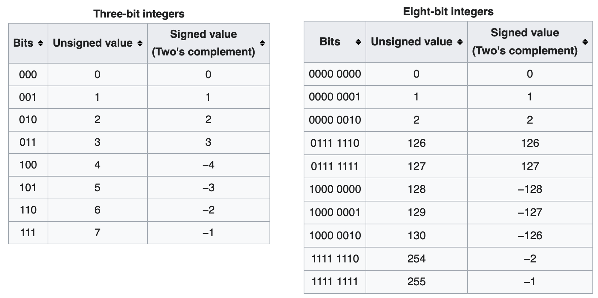

# Add Two Integer in Two's Complement Notation
- Align the two digits from the rightmost digit first, and if the digits in relative positions add up to two or more, there will be a carry.
- If there is a carry, it is passed to the left; If the leftmost digits add up to have a carry, the carry is ignored.
- Overflow
  - After adding two positive numbers, if the leftmost sign is 1, there is an overflow.
  - After adding two negative numbers, if the leftmost sign is 0, there is overflow.

# Add Two Positive Numbers in Two's Complement Notation
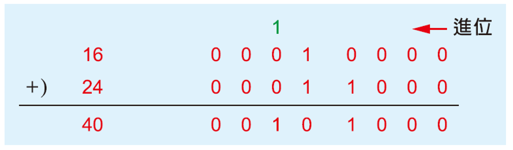
  
# Add One Positive and One Negative Numbers in Two's Complement Notation and the Result is Positive
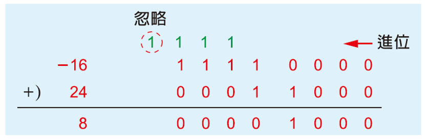

# Add One Positive and One Negative Numbers in Two's Complement Notation and the Result is Negative
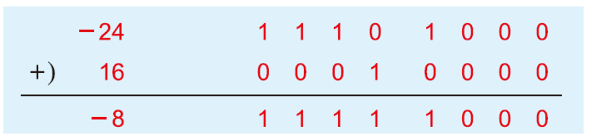

# Add Two Negative Numbers in Two's Complement Notation
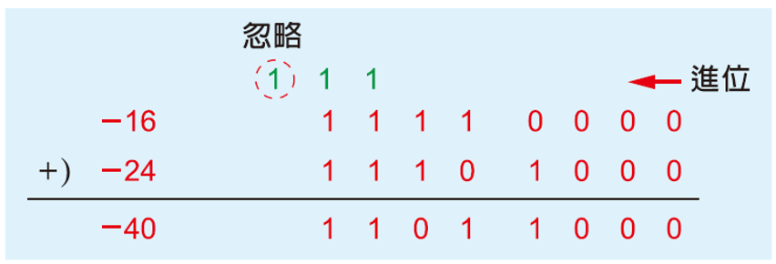
  
# (Positive) Overflow 
- The result of the addition of the sign bits is 1, that is, the addition of two positive numbers is negative. 
- Because the maximum positive number of 8-bit in two's complement notation is 127, and the result here is 129, which is beyond the positive storage range
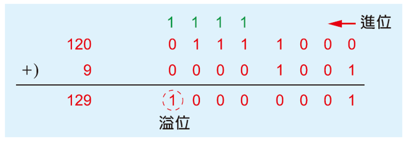

# (Negative) Overflow
- The result of the addition of the sign bits is 0, that is, the addition of two negative numbers is inversely positive.
- Because the minimum negative number of 8-bit complements is -128, and the result in this case is -129, which is already less than the negative storage range.
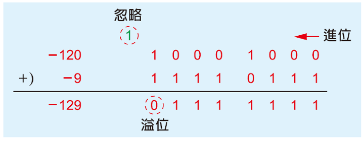

# Example of Addition
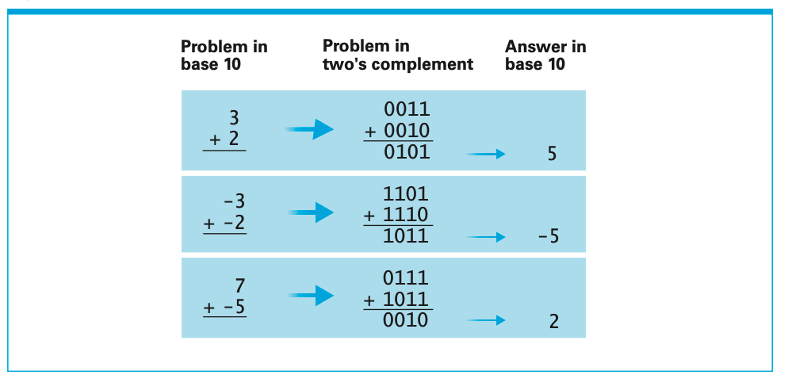

# Subtraction in Two's Complement Notation
- For example, the subtraction problem 7- 5 is the same as the addition prob-
lem 7 + (-5). Consequently, if a machine were asked to subtract 5 (0101) from 7 (0111), it would first change the 5 to -5 (1011) and then perform the addition process of 0111 + 1011 to obtain 0010, which represents 2
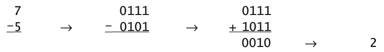

# Storing Floating-Point Number
- Floating-point notation is the most common way computers represent real numbers
- 536.87 is scientifically marked as 5.3687×102, and floating-point notation works on the same principle by moving the decimal point to "float" to the standard position.
- Normalization action to scientific notation: 10110.100011 --> 1.0110100011 * 24
  - The value to the left of the decimal point must be 1.
  - The 0110100011 to the right of the decimal point is called the mantissa(尾數) and the exponent(指數) is 4
- At present, the floating-point notation is mainly based on the IEEE 754 standard, and there are three main parts: sign bit + exponent + mantissa
 
# Precision of Floating-Point Number
- Single-precision: 1 bit for sign bit, 8 digits for exponent; 23 digits for mantissa
- Double-precision: 1 bit for sign bit; 11 digits for exponent; 52 digits mantissa
- Sign bit: 1 digit, 0 for positive numbers; 1 for a negative number.
- Exponent: 8 / 11 digits, expressed as excess 127 (Excess 127: the value obtained by subtracting 127 from the digit value is the real stored value)
- Mantissa: 23 / 52 digits, starting from the standardized decimal point, and the insufficient digits are filled with 0.

# Use IEEE 754 to Convert 10110.100011 to Single-Precision Floating-Point Number
- Normalize to 1.0110100011×24
- Positive number, so the sign bit is 0
- Mantissa: 0110100011
- Exponent: 4, stored in excess of 127, 127 must be added, obtain 131. Then, convert 131 to get 10000011
- Therefore, 10110.100011 is stored according to the IEEE 754 standard **0**10000011**01101000110000000000000**。
 
# Convert -0.0010011
- Normalize to -1.0011×2-3
- Negative number, so the sign bit is 1
- Mantissa: 0011
- Exponent: -3, stored in excess of 127, 127 must be added, obtain 124. Then, convert 124 to get 01111100
- Therefore, -0.0010011 is stored according to IEEE 754 standard 10111110000110000000000000000000

# What Single-Precision Floating Point Number is Represented as 01000010100101000110000000000000?
- Sign bit is 0, so it is a positive number
- Exponent: 10000101 = 133, subtract 127 to get 6
- Mantissa: 0010100011
- Therefore: +1.0010100011 * 26, that is, 1001010.0011。

# What Single-Precision Floating Point Number is Represented as 10000010100101000110000000000000?
- Sign bit is 1, so it is a negative number
- Exponent: 00000101 = 5, subtract 127 to get -122
- Mantissa: 0010100011
- Therefore: -1.0010100011 * 2-122

# Storing Text
- **ASCII**: In 1963, the American Standards Association (ASA) published ASCII (American Standard Code for Information Interchange) is the most popular public standard today.
- **Unicode**: developed by the Universal Code Development Committee of the United States from 1988 to 1991, has become an ISO certification standard (ISO 10646). Unicode has developed the following encoding methods:
  - UTF-8 is the most commonly used information network in the world.
  - UTF-16 is used in Java and Windows.
  - UTF-32 is used by some UNIX systems.

# ASCII 編碼方式
ASCII: American Standard Code for Information Interchange
一個字元佔用一個byte, 使用其中的7個bit, most significant bit 是 0, 總共定義128個字元
- 英文大小寫字母
- 阿拉伯數字
- 標點符號、括號以及其它符號
- 控制字元，如響鈴，退格，換行，換頁，跳出資料通訊，退出鍵 

# Unicode 編碼方式
Unicode用兩個byte來表示一個字元, 給每個字元定義一個唯一的編碼, 同一個字元, 不論是什麼平臺、不論是什麼程式語言都一樣的編碼。
字元 |Unicode   
------|:----
H|00000000 01001000
i|00000000 01101001
!|00000000 00100001
你|01001111 01100000
好|01011001 01111101

# Unicode Coverage
[search unicode of a character](https://codepoints.net)
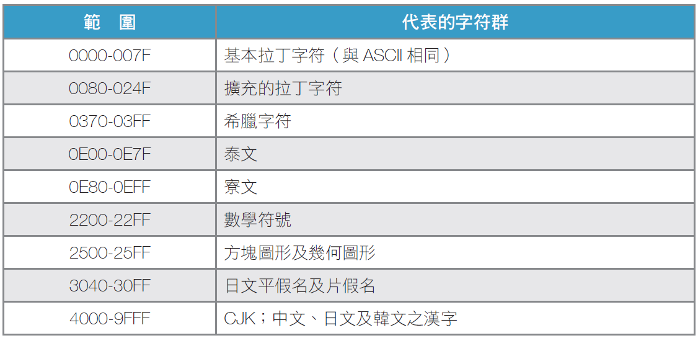

# Unicode 實現方式：UTF-8, -16, -32
- Unicode 編碼系統可分為編碼方式和實現方式兩個層次
- 每個字元的Unicode編碼確定。但是在實際傳輸過程中，由於不同系統平台的設計不一定一致，以及出於節省空間的目的，對Unicode編碼的實現方式有所不同。
- Unicode的實現方式稱為Unicode Transformation Format(UTF)
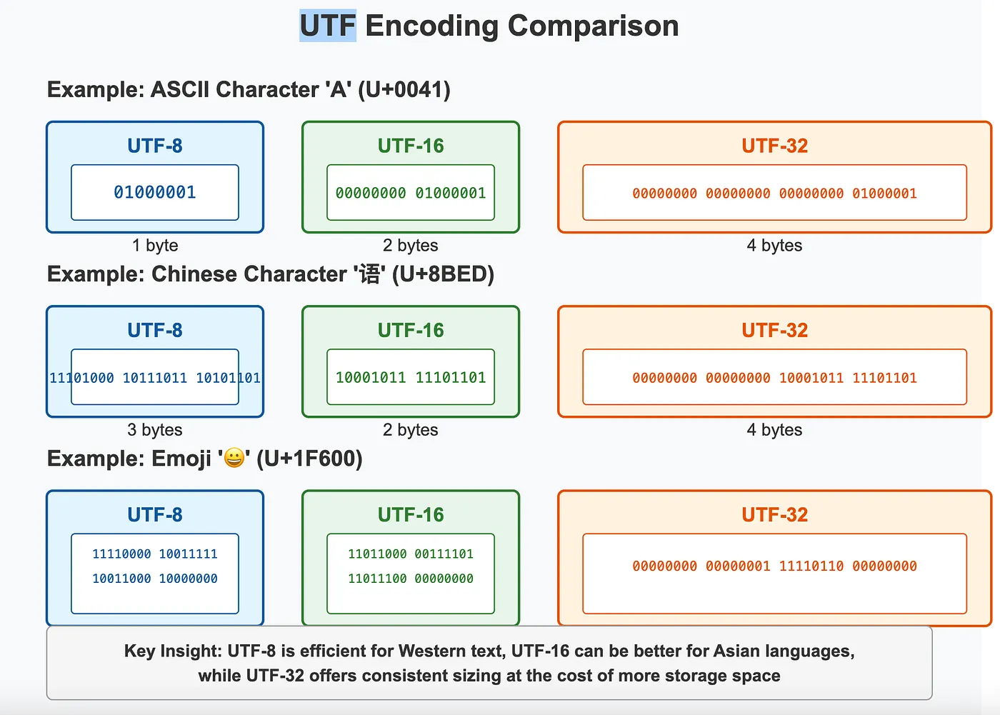

# UTF-8
- UTF-8 is a way to translate Unicode's code points into bytes for storage/transmission.
- 為了節省空間，UTF-8優化Unicode的編碼, 用一至四個bytes對Unicode字元集的所有字元進行再編碼，以增加儲存及傳輸效率 ASCII (English): 1 byte, Latin extended: 2 bytes, Chinese / Japan / Korea: 3 bytes, Emoji / Rare used characters: 4 bytes

字元 |UTF-8   
------|:----
H|01001000
i|01101001
!|00100001
你|11100100 10111101 10100000
好|11100101 10100101 10111101

# Storing Image
- Taking a black-and-white photo as an example, a small part of the photo records the gray scale (0~255) of each square, and each square can be represented by eight digits (eight zeros and 1s can have 256 combinations).
- https://market.cloud.edu.tw/resources/video/1836100
- Reference: 

# Storing Sound

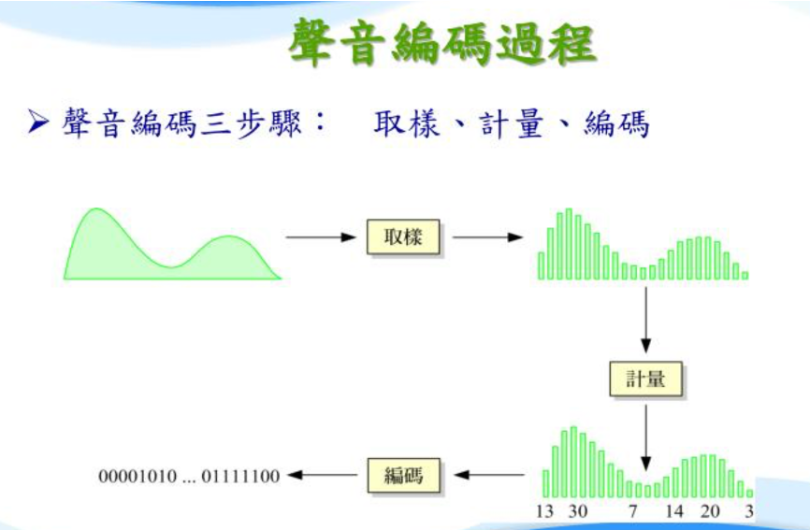

