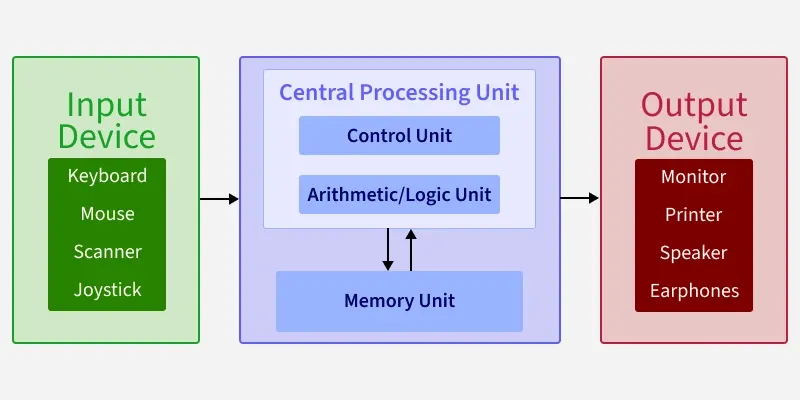
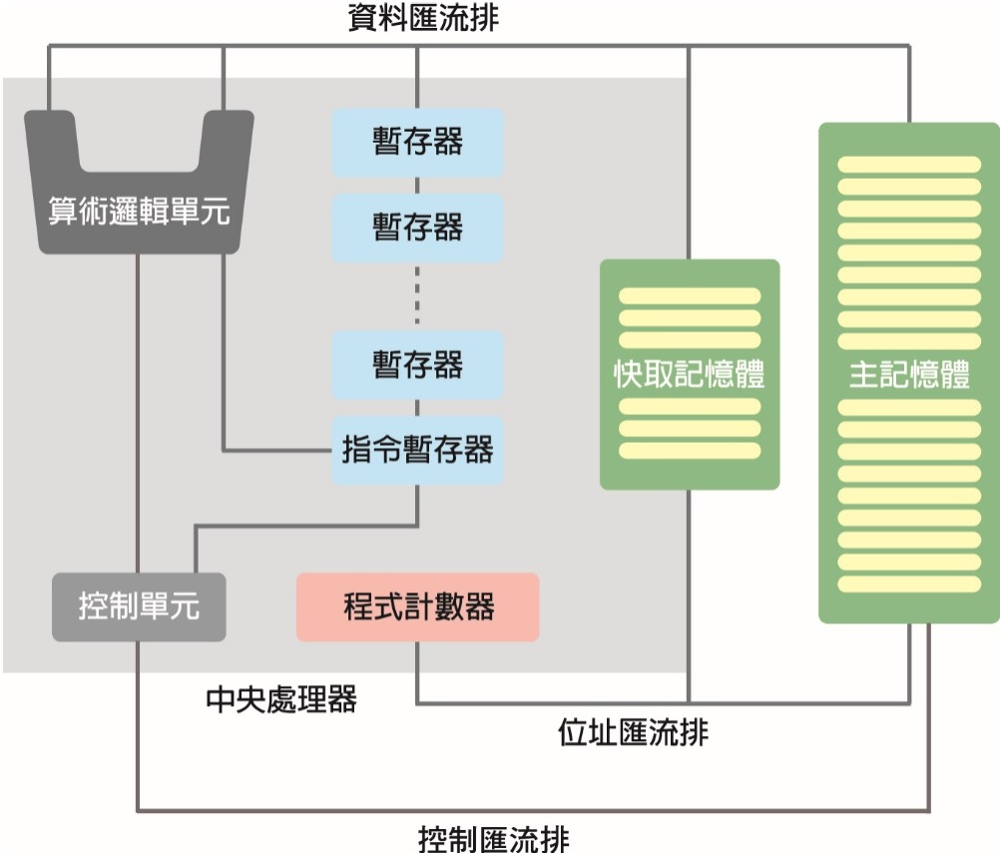
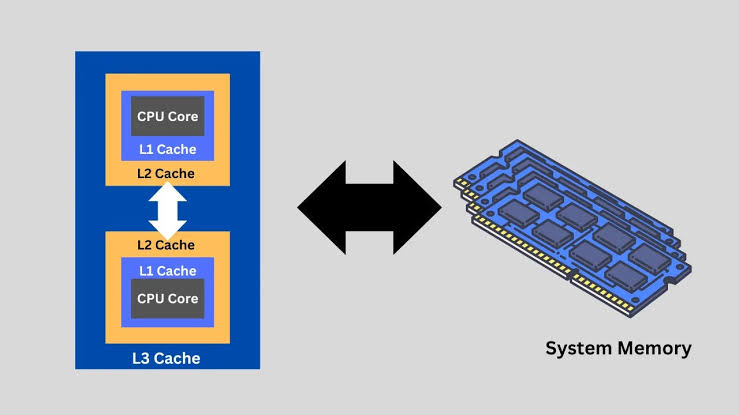
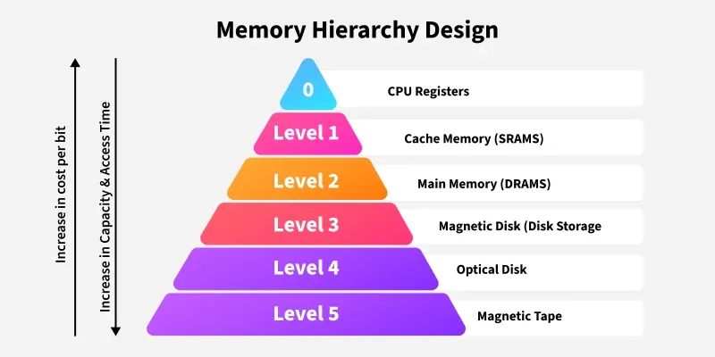
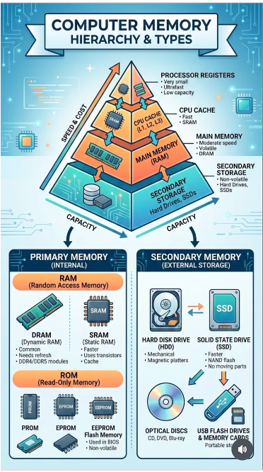
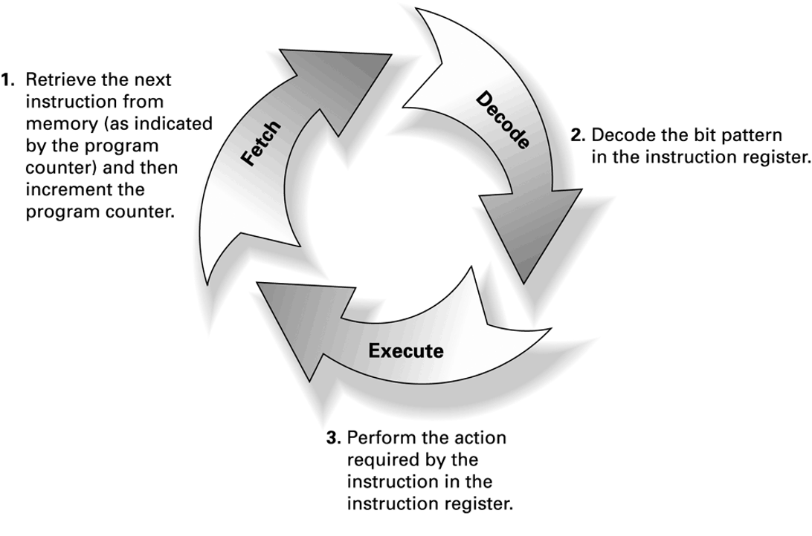
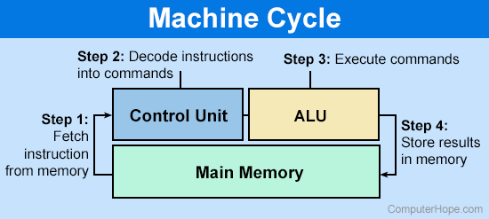

# Computer Organization
- CPU
- Main memory
- Execution of the program
- Bus and interface
- Storage device

# von Neumann Model

# CPU Basics
- Arithmetic/Logic Unit (ALU): perform operations (+, -, AND, XOR) on data
- Control Unit (CU): fetches instructions from memory, decodes them, and generates control signals to ALU, memory, and I/O devices
- Registers: temporary storage of information within the CPU
- Bus: transfer bit patterns (data, address, control) between CPU and main memory

# Linkage Architecture between CPU and Memory

# Central Processing Unit (CPU)
CPU is the brain of a computer, a chip with extremely complex circuits, which is used to execute program instructions stored in memory and control the processing and operation of digital data. It consists of
- Arithmetic Logic Unit (ALU)
- Control Unit (CU)
- Registers
- Cache

# Arithmetic Logic Unit
- Perform mathematical operations such as addition, subtraction, multiplication and division
- Perform logical operations such as AND, OR, NOT and XOR (eXclusive OR)

|p|q|p and q|p or q|p xor q|not p|
|-|-|-------|------|-------|-----|
|T|T|T      |T     |F      |F    |
|T|F|F      |T     |T      |F    |
|F|T|F      |T     |T      |T    |
|F|F|F      |F     |F      |T    |

# Control Unit
- Control the flow of computer execution programs.
- Direct each system unit to carry out the tasks required.
- Coordinate the operation of the various system units.
- For example, it moves the program instructions that need to be executed from memory to the register, decodes the instructions, and then hands them over to the ALU for operation, and then puts the results back into register or memory

# Register
- Registers are built directly into the processor core to temporarily store instructions or data. Registers offer the fastest speed and highest unit cost, but hold very little data.
- Registers can be accessed faster than the main memory, which can greatly increase the performance of the CPU.
- Two types of register
  - General-purpose register
  - Special-purpose register
    - Instruction register: hold the current instruction while the computer decodes and executes it
    - Program counter: store the memory address of the next command the computer needs to run

# Cache
- von Neumann bottleneck: No matter how fast the CPU and memory are, the overall system speed will ultimately be limited by the speed of the bus.
- Cache improves CPU performance by keeping frequently or recently used data and instructions close to the CPU, reducing expensive accesses to main memory.
- In modern processor architectures, the entire cache hierarchy (L1, L2, and usually L3) is integrated directly onto the silicon die of the CPU to minimize latency and maximize memory bandwidth.

# Cache Hierarchy
| Cache Level | Physical Location | Typical Size | Relative Speed|
| :--- | :--- | :--- | :--- |
| **L1 Cache** | Inside CPU Core (On-Die) | 32 KB – 64 KB | Fastest (~1 ns) |
| **L2 Cache** | On-Die (Near Core)  | 512 KB – 2 MB+ | Very Fast (~3–4 ns) |
| **L3 Cache** | On-Die (Shared)  | 8 MB – 96 MB+ | Fast (~10–15 ns) |

# Cache Location

# Bus
In the architecture of the linkage between CPU and memory, there are some transmission tools for transmitting electronic signals, called bus

| Bus | Purpose | Typical Direction |
|---|---|---|
| **Address Bus** | Specifies **where** to access | CPU → Memory |
| **Data Bus** | Transfers **what** is being read/written | CPU ↔ Memory |
| **Control Bus** | Specifies **what operation** to perform | Both directions |

CPU&nbsp;&nbsp;&nbsp;&nbsp;&nbsp;&nbsp;&nbsp;&nbsp;&nbsp;&nbsp;&nbsp;&nbsp;&nbsp;&nbsp;&nbsp;&nbsp;&nbsp;&nbsp;&nbsp;&nbsp;&nbsp;&nbsp;&nbsp;&nbsp;&nbsp;&nbsp;&nbsp;&nbsp;&nbsp;&nbsp;&nbsp;&nbsp;&nbsp;&nbsp;&nbsp;&nbsp;&nbsp;&nbsp;&nbsp;&nbsp;&nbsp;&nbsp;&nbsp;&nbsp;&nbsp;&nbsp;&nbsp;&nbsp;&nbsp;&nbsp;&nbsp;&nbsp;&nbsp;&nbsp;&nbsp;&nbsp;&nbsp;&nbsp;&nbsp;&nbsp;Memory
 │── Address: 1000 ───────►│
 │── Data: 42 ──────────►│
 │── Control: WRITE ───────►│

# Memory
- Memory is divided into various types based on speed, unit price, and attributes.
- Memory is used to store data and the results of calculations.
- In the von Neumann model, the memory stores both programs and data.

# Main Memory Addressing
- Each location in main memory has an address to access its contents

| Address | Content |
|---|---|
|0000 0000 0000 0000| 10110101 |
|0000 0000 0000 0001| 01101011 |
|0000 0000 0000 0010| 11110001 |
|.....| ..... |
|1111 1111 1111 1111| 01010101 |

- Addresses are represented in 16 bits, with a maximum of 216 = 65,536 addresses

# More Main Memory, More Execution Speed
- Main memory is slower than cache, but still faster than hard drives.
- The larger the memory, the more programs and data can be loaded from the hard drive into memory, resulting in higher CPU execution efficiency.
- If the program or data is too large to load into limited memory, the CPU must read data or programs from the hard drive, which slows down the entire process.

# Memory: RAM & ROM
- RAM (Random Access Memory): Once power off, the data disappears
- ROM (Read-Only Memory): After power off, the ROM can retain its data and can be used to store programs used for boot.
- Both can read data randomly, but RAM allows users to freely rewrite content.

# RAM: SRAM & DRAM
- SRAM is fast and expensive → Cache
- DRAM is slower and cheaper → Main Memory

| Feature | DRAM | SRAM |
|---|---|---|
| Full Name | Dynamic RAM | Static RAM |
| Speed | X | 4X |
| Cost | Cheaper | More expensive |
| Capacity | 4C | C |
| Refresh | Required | Not required |
| Storage Cell | 1 transistor + 1 capacitor | Typically 6 transistors |
| Volatile | Yes | Yes |

# ROM: PROM, EPROM, EEPROM
- PROM (Programmable ROM): Write once
- EPROM (Erasable Programmable ROM): Erase with UV light
- EEPROM (Electrically Erasable Programmable ROM): Erase electrically
> Flash memory is essentially an evolution of EEPROM. It makes for mass-storage devices such as SSDs, USB flash drives, and memory cards.

# Acer Aspire XC-1860 桌上型電腦 
> [ACER Aspire XC-1860](https://store.acer.com/zh-tw/xc-1860)

- OS: Windows 11 Home
- CPU: Intel Core Ultra 5 225 (U5-225)
  - 10 cores, base clock 3.30 GHz
  - 20MB L3 cache
- Main memory: 16G * 1 DDR5 SDRAM
- GPU: iGPU (integrated GPU) or Intel UHD
  - Built onto CPU chip
  - Share DDR5 SDRAM
- Chipset: Intel H810

# Acer Aspire XC-1860 桌上型電腦 (continued) 
- SSD: 1TB PCIe 4.0
- Network: Gigabit Ethernet, Wi-Fi 5/6
- I/O ports: PCIe x16 slot, USB 3.0 Type-A / Type-C, USB 2.0 Type-A, HDMI, DisplayPort

# Program Execution

    
    

# Fetch-Decode-Execute Cycle
1. **Fetch**: The CPU fetches the instruction from memory at the address specified by the program counter (PC) and stores it in the instruction register (IR).
2. **Decode**: The control unit decodes the instruction in the IR to determine what operation to perform and what operands are needed.
3. **Execute**: The CPU performs the operation specified by the instruction, which may involve reading/writing data from/to memory or performing calculations in the ALU. After execution, the program counter is updated to point to the next instruction, and the cycle repeats.