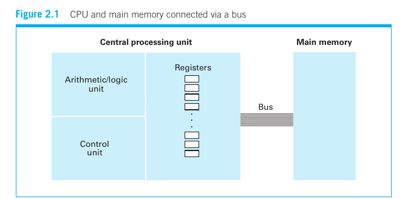
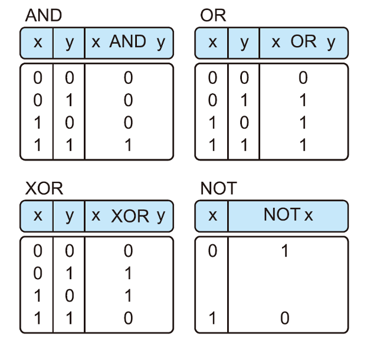
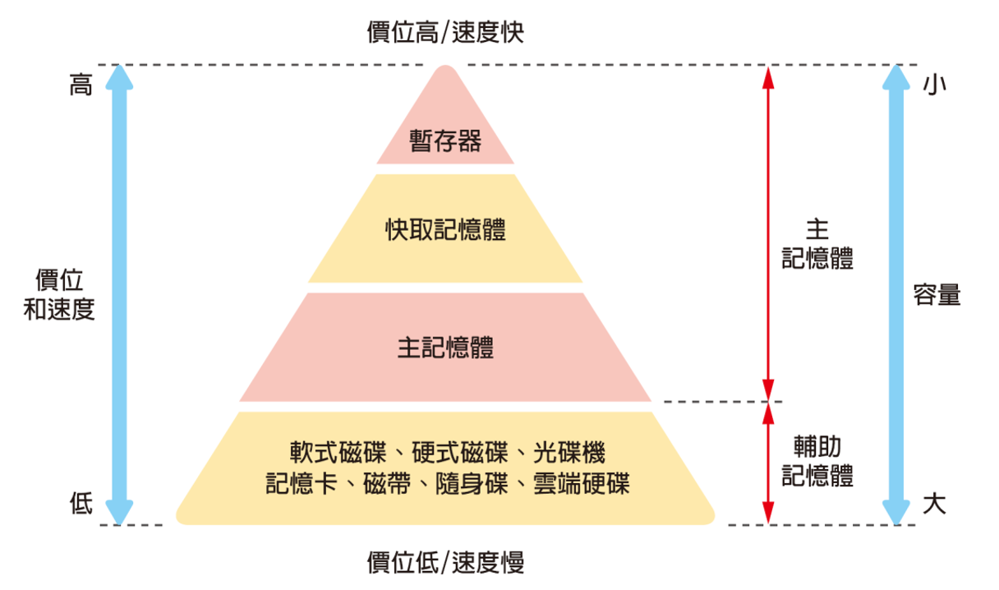

# Computer Organization
- CPU
- Main memory
- Execution of the program
- Bus and interface
- Storage device

# von Neumann Model

# CPU Basics
- Arithmetic/Logic Unit (ALU): perform operations (+, -, AND, XOR) on data
- Control Unit (CU): fetches instructions from memory, decodes them, and generates control signals to ALU, memory, and I/O devices
- Registers: temporary storage of information within the CPU
- Bus: transfer bit patterns (data, address, control) between CPU and main memory

# Linkage Architecture between CPU and Memory

# Central Processing Unit (CPU)
CPU is the brain of a computer, a chip with extremely complex circuits, which is used to execute program instructions stored in memory and control the processing and operation of digital data. It consists of
- Arithmetic Logic Unit (ALU)
- Control Unit (CU)
- Registers

# Arithmetic Logic Unit
- Perform mathematical operations such as addition, subtraction, multiplication and division
- Perform logical operations such as AND, OR, NOT and XOR (eXclusive OR)

# Control Unit
- Control the flow of computer execution programs.
- Direct each system unit to carry out the tasks required.
- Coordinate the operation of the various system units.
- For example, it moves the program instructions that need to be executed from memory to the register, decodes the instructions, and then hands them over to the ALU for operation, and then puts the results back into register or memory

# Register
- CPU has a very small storage device, called a register, that can temporarily store instructions or data.
- Registers can be accessed faster than the main memory, which can greatly increase the performance of the CPU.
- Two types of register
  - General-purpose register
  - Special-purpose register
    - Instruction Register: hold the current instruction while the computer decodes and executes it
    - Program Counter: store the memory address of the next command the computer needs to run

# Bus
In the architecture of the linkage between CPU and memory, there are some transmission tools for transmitting electronic signals, called bus

| Bus | Purpose | Typical Direction |
|---|---|---|
| **Address Bus** | Specifies **where** to access | CPU → Memory |
| **Data Bus** | Transfers **what** is being read/written | CPU ↔ Memory |
| **Control Bus** | Specifies **what operation** to perform | Both directions |

CPU&nbsp;&nbsp;&nbsp;&nbsp;&nbsp;&nbsp;&nbsp;&nbsp;&nbsp;&nbsp;&nbsp;&nbsp;&nbsp;&nbsp;&nbsp;&nbsp;&nbsp;&nbsp;&nbsp;&nbsp;&nbsp;&nbsp;&nbsp;&nbsp;&nbsp;&nbsp;&nbsp;&nbsp;&nbsp;&nbsp;&nbsp;&nbsp;&nbsp;&nbsp;&nbsp;&nbsp;&nbsp;&nbsp;&nbsp;&nbsp;&nbsp;&nbsp;&nbsp;&nbsp;&nbsp;&nbsp;&nbsp;&nbsp;&nbsp;&nbsp;&nbsp;&nbsp;&nbsp;&nbsp;&nbsp;&nbsp;&nbsp;&nbsp;&nbsp;&nbsp;Memory
 │── Address: 1000 ───────►│
 │── Data: 42 ──────────►│
 │── Control: WRITE ───────►│

# Memory
- Memory is divided into various types based on speed, unit price, and attributes.
- Memory is used to store data and the results of calculations.
- In the von Neumann model, the memory stores both programs and data.

# Registers and Cache
- Registers: Built directly into the processor core. They offer the fastest speed and highest unit cost, but hold very little data.
- L1, L2, L3 Cache: Small, very fast memory close to the CPU. They store data the processor uses most often.

